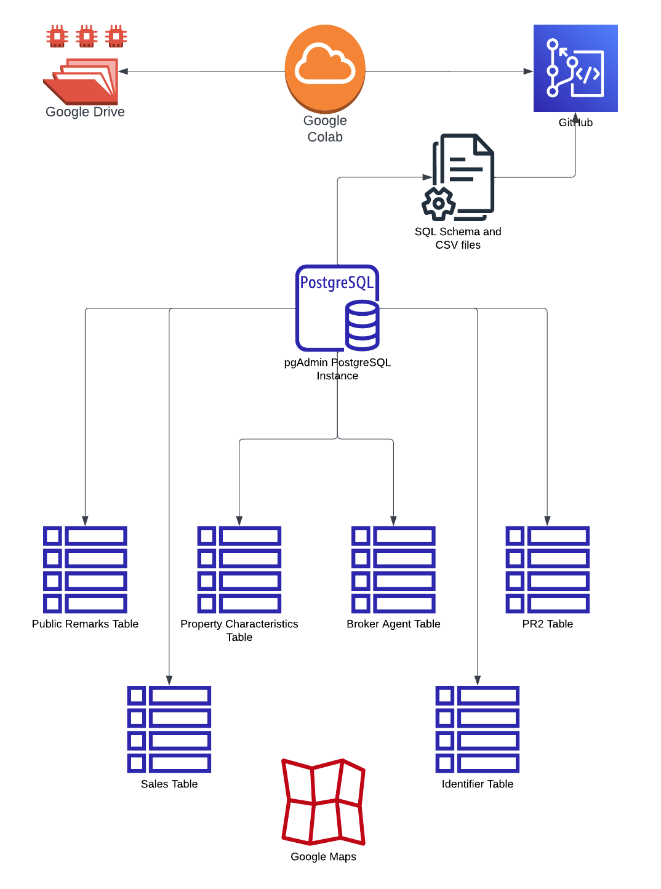
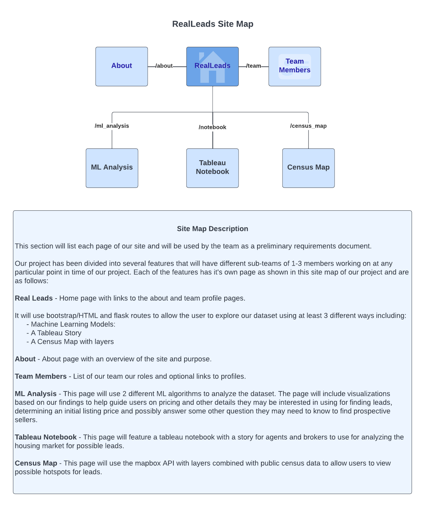
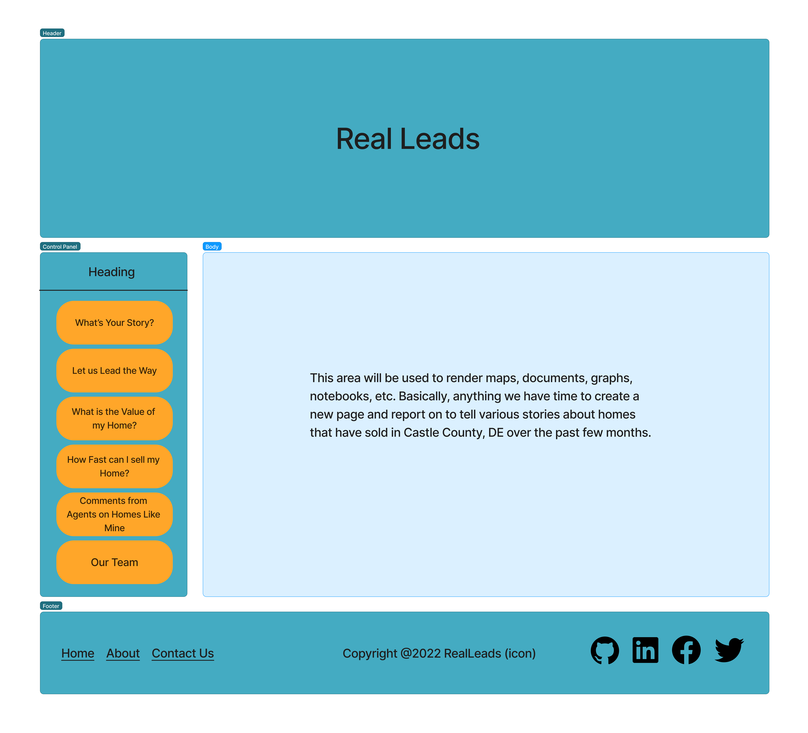

# RealLeads

## Overview

The real estate industry has a significant impact on the American economy. There are several indicators that affect real estate sales such as location, property characteristics and the economy including the job market, economic cycle and interest rates etc. These indicators help us the determine current approximate value of the property.

## Goal

Whether you are a buyer, seller, agent or investor, everyone has two big questions:

- How much can I sell my home for?
- How fast can my house be sold?

In this project we will try to find answers for these questions using the data set below from 2019-2022 in New Castle, DE.

## Description of Data Source

We will be using:

- Multi Listing Service Data (MLS)
- Public Record (PD)
- Mortgage Data (MD)
- Census Data (CD)
- APIs

## Architecture

## Software Used

## Machine Learning Model

### Supervised

##### What would be the optimal sales price?

The first stage of the data preprocessing involves merging multiple tables to create a machine learning ready data table. Each merge tage involves further data cleaning such as column dropping and disposing any rows that have NaN value.

Once the data is cleaned and have no NaN values, we begin on scaling the data using the StandardScaler() method to alleviate data that are spread out and scales it tighter.

The data is split using the train_test_split method. The data is split in a 80/20 form where 80 percent of the data is being fitted to a machine learning model and the 20 percent will be use to test the machine learning model.

The model that we will be using to predict list and sold price of a house is a random forest regressor model which is a regression model. This model has benefits such as retraining on random states to find the best tree to use and also has built in functions 
that helps find out what features have the strongest weight when determine the target variable.

##### How fast can my house be sold?

To preprocess data, it was important to look at all data to find what needs to be cleaned and used. Looking at all tables, it was found that the prop_charac, pub_rec, and sales_data tables. We used the .info() method to find the data types and non-null counts for all columns in each table. Using the majority of the columns without any null values, we were able to then determine which features to include. After choosing features, we cleaned the specific features. Any objects were changed into categories, and then each category point was changed into a number, since all data points need to be numeric. 

The features were determined using both market knowledge and non-null values in columns. After running the machine learning model, were able to use feature_importances_ from the BalancedRandomForestClassifier module to see which features were mostly impacting the model results. This provided us with more information to drop unnecessary rows as well as any rows with repeated information.  

The data was split into training and testing sets using train_test_split(X, y). This splits the data into two sections: 80% fit to the machine learning model and 20% used to test the machine learning model.

The best model at this point in the analysis is the Balanced Random Forest Classifier. A classifier model is the type of machine learning model we are using because we are trying to split the data into one of four groups, depending on the range of predicted days on market. This model was able to obtain an accuracy score of 33.8% after dropping some columns and only including 13 columns. 

### Unsupervised

## Results

## Team Members

- Square:
- Triangle:
- Circle:
- X:

## Presentation
[Link to Presentation](https://www.canva.com/design/DAFT70_iCEI/dEdaMSujGwRQv8tqX6JlCQ/view?utm_content=DAFT70_iCEI&utm_campaign=designshare&utm_medium=link&utm_source=publishsharelink)

## Site Map

## Home Page Example

