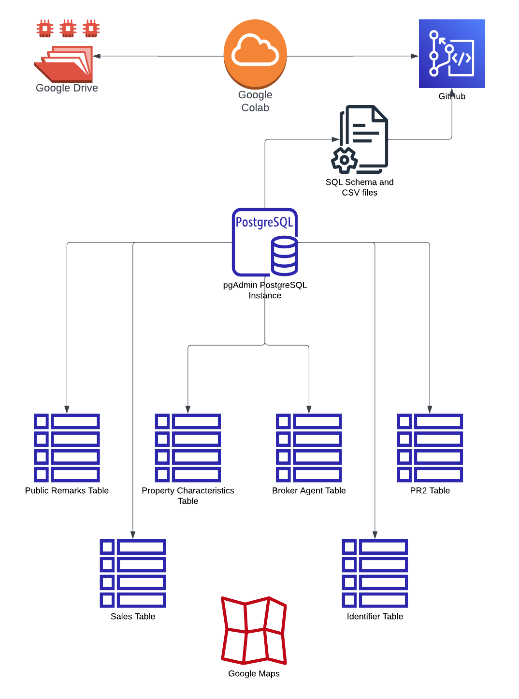

# RealLeads

## Overview

The real estate industry has a significant impact on the American economy. There are several indicators that affect real estate sales such as location, property characteristics and the economy including the job market, economic cycle and interest rates etc. These indicators help us the determine current approximate value of the property.

## Goal

Whether you are a buyer, seller, agent or investor, everyone has two big questions:

* How much can I sell my home for?
* How fast can my house be sold?

In this project we will try to find answers for these questions using the data set below from 2019-2022 in New Castle, DE.

## Description of Data Source

We will be using:

* Multi Listing Service Data (MLS)
* Public Record (PD)
* Mortgage Data (MD)
* Census Data (CD)
* APIs

## Architecture

## Software Used

## Machine Learning Model

### Supervised

- What would be the optimal sales price?
- How fast can my house be sold?

### Unsupervised

## Results

## Team Members

- Square:
- Triangle:
- Circle:
- X:

## Presentation

https://www.canva.com/design/DAFT70_iCEI/dEdaMSujGwRQv8tqX6JlCQ/view?utm_content=DAFT70_iCEI&utm_campaign=designshare&utm_medium=link&utm_source=publishsharelink

## Site Map

## Home Page Example

