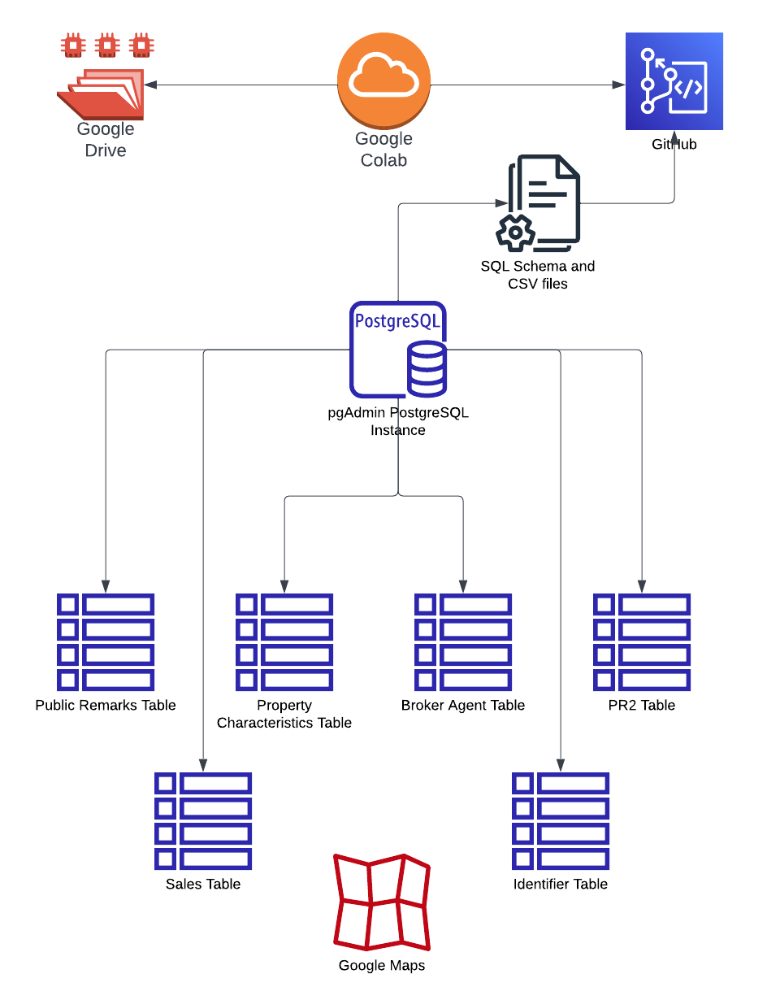
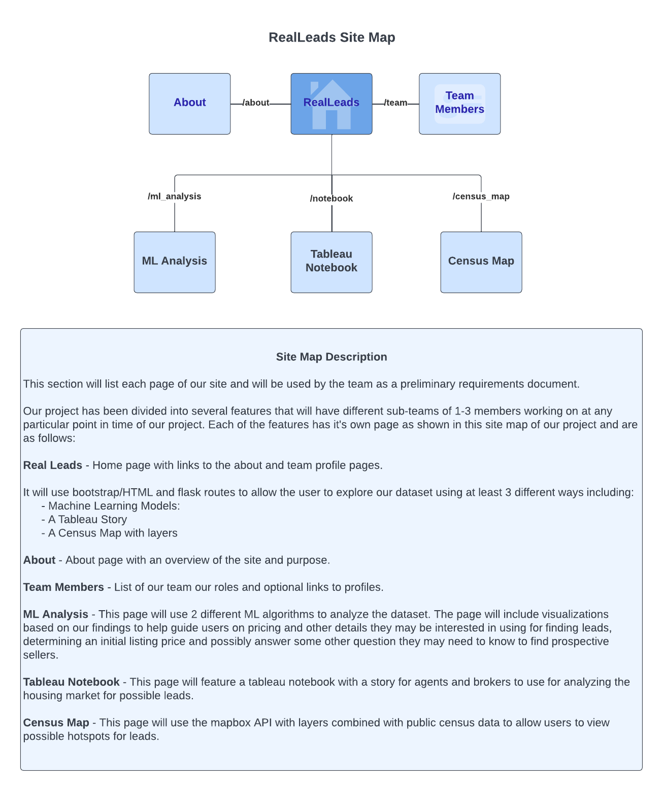
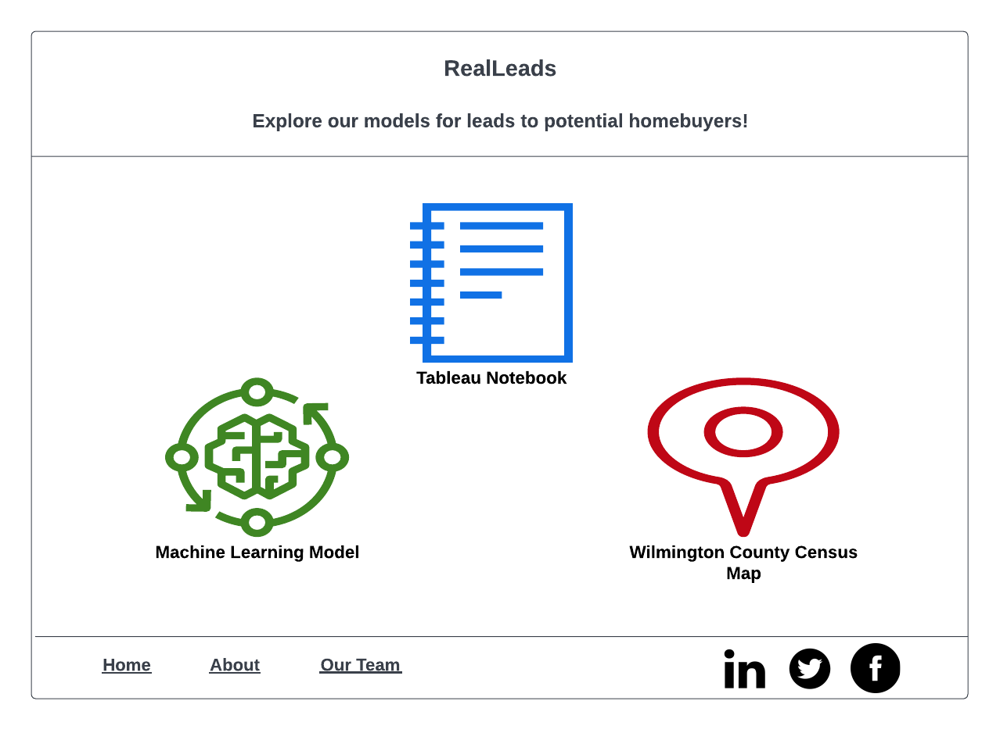

# RealLeads

## Overview

The mobility in the real estate sector has a significant impact on the American economy. There are several indicators that effect real estate sales such as location, property characteristics, days on the market, mortgage type, previous transactions etc. These indicators help us the determine current approximate value of the property.

## Goal

Whether we are investor or not, everyone has 2 big questions:

* What would be the optimal sales price?
* How fast can my house be sold?

In this project we will try to find answers for these questions using the data set below from 2019-2022 in New Castle, DE.

## Description of Data Source

We will be using:
* Multi Listing Service Data 
* Public Record 
* Mortgage Data to perform our analysis. 

## Architecture

<<<<<<< HEAD
## Software Used

## Machine Learning Model

### Supervised
* What would be the optimal sales price?

### Unsupervised
* How fast can my house be sold?

## Results

## Team Members
* Square: 
* Triangle: 
* Circle: 
* X:

=======
>>>>>>> Stef
## Site Map

## Home Page Example

