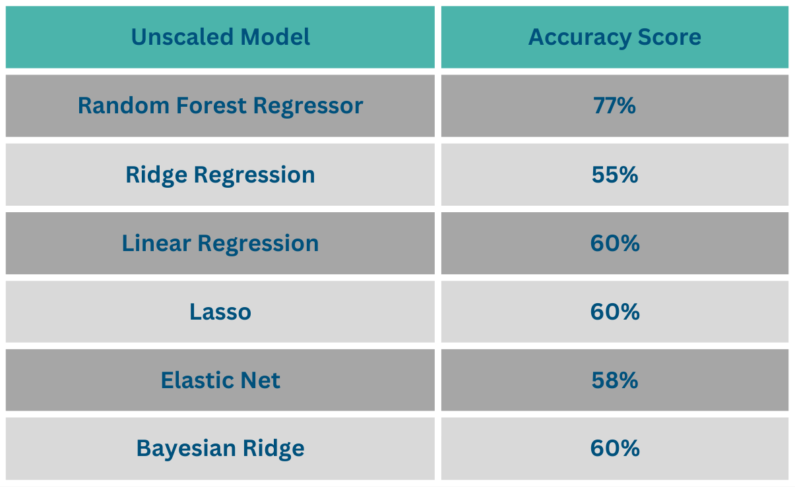
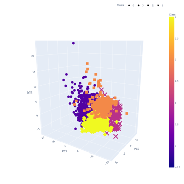
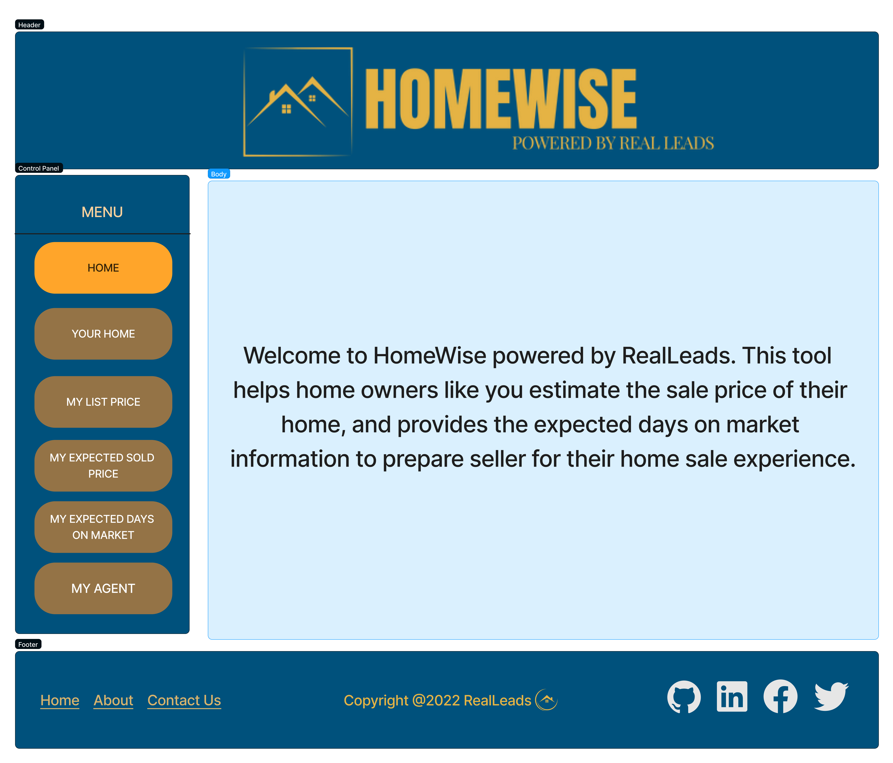

# RealLeads

## Overview

The real estate industry has a significant impact on the American economy. There are several indicators that affect real estate sales such as location, property characteristics and the economy including the job market, economic cycle and interest rates etc. These indicators help us the determine current approximate value of the property.

Whether you are a buyer, seller, agent or investor, everyone has similar questions:

- How much can I sell my home for?
- How fast can my house be sold?

In this project we are creating a real-world simulation. While we are trying to find an answer for these questions.
We have established a hypothetical company called REALLEADS which is a real estate focused fintech company that works as a matchmaker between agents and home sellers. RealLeads has been in business for about five years. Their initial product was the “RealLeads Agent Console”, a portal that serves up home seller leads and also acts as a CRM (Customer Relationship Management) database for agents.

Now that RealLeads has been in business successfully for five years, investors want to see product expansion and increased revenue. Our RealLeads data and product development team has been tasked with coming up with a new idea that can be monetized.
Our team, RealLeads proposes creating a new portal, this time targeted at retail clients themselves. . The portal, “RealLeads Homewise”, will help home sellers get a sense of at what price they might list their home for, what to expect for a sold price, and also get a sense of the number of days a home can be expected to stay on the market.

The tool will capture user data which can be monetized by RealLeads, and there is also a click to call/email feature that puts the Seller/user in touch with an agent who pays for the lead, and provides an additional revenue source for RealLeads.

## Description of Data Source

We used:

- Multi Listing Service Data (MLS) (2019-2022)
- Public Record (PD)
- Mortgage Data (MD)
- Census Data (CD)
- APIs – Google Maps

ETL Processes:

- Selection/cleansing
- PostgresSQL Database
- Tables use MLSNumber as primary key
- Connections using psycopg2

## Tools Used

Languages:
Python, JavaScript, PostgreSQL

Software:
VS Code, JupyterNotebook, Pandas, Numpy, Scikit-Learn, psycopg2, Flask, pgAdmin4, HTML, CSS, Matplotlib, Plotly, Pickle, Seaborn, Figma

## Machine Learning Model

### Supervised

We start predicting the listing price first and followed with sold price and the date range, because each machine learning builds off of each other that requires the previous model’s information.

Eighty percent of the data is being used to train the model while the remaining twenty percent is used to test the model. Once that is done we begin testing on multiple models.

Predicting the list price:

List Price Prediction Results:

RandomForestRegressor model is being the best option, we decided to attempt one more method which is scaling our data with a StandardScaler. StandardScaler is used to reallocate the distribution of values so that the mean is 0 and the Standard Deviation is 1. Model accuracy became 75%

Predicted Sold Price:

To predict the sold price of the house which we add the original list price to our existing data table to help figure out what the prediction on what the house would be sold for. Because of built in fuctions and retraining on random states we decided to stick with Random Forest Regressor. Model accuracy: 86%

Predicting the Days On Market:

We decided to use Balanced Random Forest Regressor with 70% model accuracy and used 2 buckets as "Less Than 2 Months" and "More Than 2 Months" to be able to provide an information to seller.

### Unsupervised Machine Learning

This step was an optional steps for RealLeads team, but we wanted to see if we can find any correlation with the data points, we have by clustering data points using unsupervised learning. We used a different data table compared to the supervised machine learning model where we included majority of columns of data to see if there are any findings within the data. Once the data was cleaned, we began to use a method called the Principal Component Analysis(PCA) which performs a dimensionality reduction on our data table and normalize it.

## Results and Conclusion

In conclusion, we were able to connect MLS and public record data to use in predicting suggested list Price, expected sold price, and expected days on market. We achieved this task by using a microcosm of the United States, New Castle County, Delaware.

In the future, we will enhance user interaction with our three machine learning models. Additionally, we plan to enhance map and data retrieval to give an improved user expirience. We will also include click to call, email, and text buttons to connect with an agent, and build out and productionalize our prototype.

## Team Members

- Square: Stefanie, Deanna
- Triangle: Adam, Madeline
- Circle: Hande, Vince
- X: Hande, Vince

## Presentation

[Link to Presentation](https://docs.google.com/presentation/d/1-YzIQPatpTEpIFAhW6gHMTvsAfdLA-Fpdy_GGFksvzw/edit#slide=id.g1ceed380762_2_197)

## Home Page Example

 

## Homewise Application Release Notes

- To install packages run `pip install -r requirements`
- Create the following Config files:
  - In the leads_map folder add config.py with `mapbox_token` set to your token for mapbox. Without this token the map used in the app will fail to render.
  - In the static/js/folder add confit.js with `API_KEY` set to your Google maps API. This may not be necessary since this route is no longer accessed by the app but the code for the route still exists in GitHub and may fail if this file is not found.
- To start the application use `flask run`

The application is a work in progress so if any issues are found, please feel free to contact our team!
